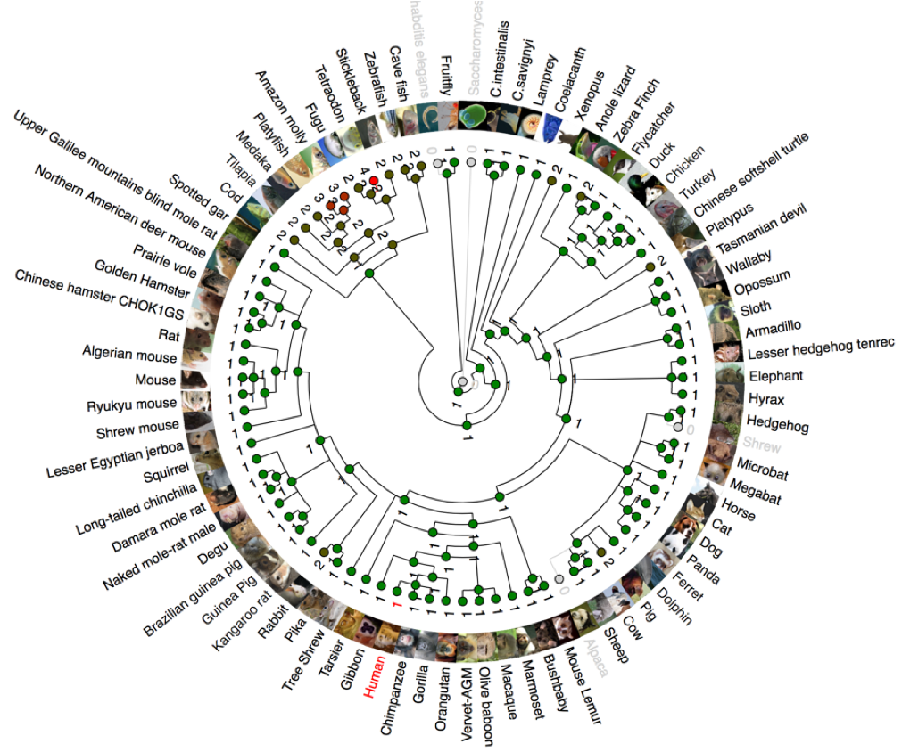
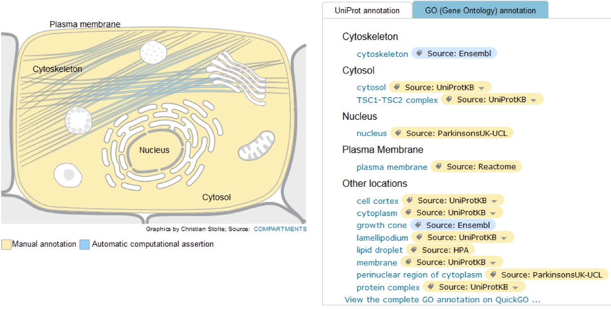
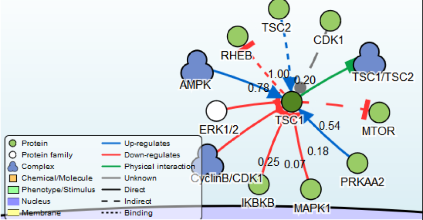
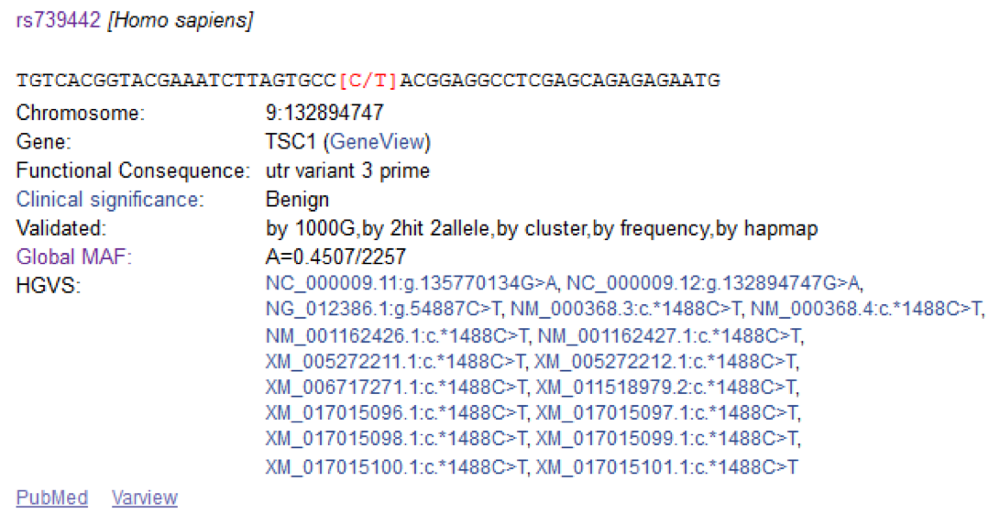
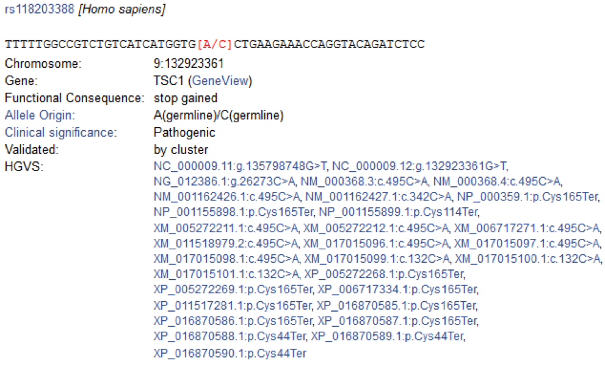
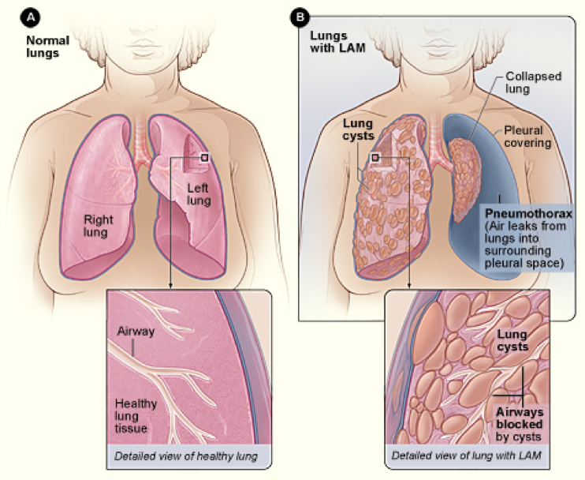

# Bioinformática: Trabajo práctico

- Juan Pablo Orsay - 49373
- Horacio Miguel Gomez - 50825


## Introducción

En el siguiente trabajo realizaremos un análisis sobre la **Esclerosis tuberosa**, específicamente sobre el gen **TSC1**, encontrado en el cromosoma 9 y es el encargado de encodear la proteína llamada Hamartina.

Fuente para el archivo genebank: [NCBI](https://www.ncbi.nlm.nih.gov/nuccore/NG_012386.1?from=5001&to=58286&report=genbank)

## Requerimientos

### Python
Para ejecutar el proyecto es necesario tener instalado la versión 3.6 de Python.

Ejecutar el archivo `init.sh` para instalar el entorno virtual y sus dependencias.

## Ejercicios

Para ejecutar cualquier ejercicio es tan simple como correr:
```
./venv/bin/python src/exX.py
```

Todos los ejercicios tienen el comando `-h` que imprime la ayuda de el mismo.

Se incluyeron una serie de scripts que tienen invocaciones por defecto utilizando los datos provistos.
Para su correcto funcionamiento deben de ser ejecutados en orden (ejercicio 1 primero, el 2 segundo y así sucesivamente).

### Ejercicio 1
Para ejecutar el ejercicio 1:
```
./ej1.sh
```
El script convertirá un archivo en formato GeneBank a formato Fasta para ser utilizado en el resto de los ejercicios.

### Ejercicio 2
#### Ejercicio 2.a

Si se quiere ejecutar el ejercicio 2 utilizando una base de datos BLAST local, se deberá contar con:

- El comando `blastx` en el `PATH` del sistema operativo
- La base de datos `swissprot` correctamente instalada y debe de poder ser encontrada por el comando `blastx`

Para configurar correctamente BLAST, referirse a la [documentación oficial](https://www.ncbi.nlm.nih.gov/books/NBK279690/).

Es posible ejecutar el ejercicio 2 utilizando un BLAST local o remoto (ver ayuda para instrucciones sobre su configuración)

Para ejecutar una versión preestablecida utilizando BLAST remoto ejecutar el siguiente script:
```
./ej2.sh
```

#### Ejercicio 2.b

Podemos ver que los primeros 10 alineamientos están dominados por matches con otras proteínas humanas, sin embargo podemos también ver que aparecen los genes de TSC1 de ratas y ratones con un *Expect value* **muy** cercano a cero, lo que significa que el match fue significativo.

A su vez, podemos ver que uno de los matches pertenece a un organismo denominado *PANTR*, o *Pan troglodytes* (Chimpanzee).

Ambos resultados son interesantes ya que muestran las similitudes en ciertas proteínas que compartimos con los chimpanzees, ratas y ratones.


### Ejercicio 3

#### Multiple Sequence Alignment
El ejercicio 3 fue resuelto utilizando un servicio externo para realizar el MSA: https://www.ebi.ac.uk/Tools/msa/mafft/

Analizando el archivo generado en el ejercicio 2, *ej2_out.txt*, obtuvimos los **id** de los 10 mejores alineamientos y, utilizando estos IDs, realizamos consultas a la base de datos de BLAST para obtener las secuencias mediante el siguiente comando:

```
blastdbcmd -db swissprot -entry ID
```

Con cada salida de ese programa, generamos un archivo llamado **msa.fasta**, el cual fue utilizado en el servicio mencionado arriba para realizar el alineamiento múltiple.
La salida se encuentra en **aln-fasta.fasta**.

El script `ex3.py` es un punto de entrada para trabajar con la librería `AlignIO` de `BioPython` para manipular el MSA. Actualmente consume el archivo `msa.fasta`.

Para ejecutar una versión preconfigurada, ejecutar el siguiente script:

```
./ej3.sh
```

### Ejercicio 4

Para ejecutar una versión preconfigurada, ejecutar el siguiente script:

```
# Buscará aquellos matches en el archivo ej2_out.txt que contengan
# la palabra 'Tuberous' y utilizará Entrez para buscar la secuencia completa
# de cada match.
./ej4.sh
```

### Ejercicio 5

Para ejecutar una versión preconfigurada, ejecutar los siguientes scripts:

```
# Encuentra los ORFs del gen TSC1
./ej5.a.sh

# Utiliza la base de datos de PROSITE para encontrar motifs
# de la secuencia de proteinas del gen TSC1.
./ej5.b.sh
```

### Ejercicio 6
#### a) Proteina
El link de NCBI-Gene para el gen TSC1 es:
(https://www.ncbi.nlm.nih.gov/gene/7248)
La proteína relacionada es la Hamartina y su función principal es la de supresora del crecimiento de tumores.
La elegimos porque el alumno Gomez tiene su ahijado con esta enfermedad. Es una enfermedad muy rara (1 en 6000 recien nacidos) que afecto el crecimiento del niño, tiene tumores en el cerebro, riñones, retina, etc. Estos tumores (no-cancerígenos) por medio de alteraciones físicas (como el pinzamiento de vasos sanguineos) generan retraso mental y otros problemas.

#### b) Homologos

En *NCBI* la información de Homólogos es reducida, sólo hace referencia a las especies más cercanas al Homo Sapiens.

https://www.ncbi.nlm.nih.gov/homologene/314
* Homo sapiens (human)
* Pan troglodytes (chimpanzee)
* Macaca mulatta (Rhesus monkey)
* Canis lupus familiaris (dog)
* Bos taurus (cattle)
* Mus musculus (house mouse)
* Rattus norvegicus (Norway rat)
* Gallus gallus (chicken)
* Xenopus tropicalis (tropical clawed frog)
* Danio rerio (zebrafish)

Buscando en Ensembl encontramos el árbol más completo y pudimos ver que no solo afecta a los primates y vertebrados sino también llega a la mosca de la fruta y algunos invertebrados marinos.



#### c) transcripts & alternative splicing

En cuanto a transcripciones y alternative splicing notamos que hay muy poca información relevante tatno en NCBI como en Ensembl.

En general son isoformas de la misma proteina sin cambios funcionales relevantes. Algunas de ellas "predictas" pero sin evidencia analítica.

Cantidades:

NCBI: 19
https://www.ncbi.nlm.nih.gov/unigene/?term=TSC1

Ensembl: 8 transcripts.
http://www.ensembl.org/Homo_sapiens/Gene/Splice?db=core;g=ENSG00000165699;r=9:132891348-132944633

#### d) Interacciones

La interacción más importante de nuestro gen TSC1 de la proteína **Hamartina** es sin duda el gen TSC2 de la proteína **Tuberina**.

Buscamos información sobre como es esta interacción y [encontramos en PubMed #10585443](https://www.ncbi.nlm.nih.gov/pubmed/10585443) que en el complejo TSC la Tuberina tiene la actúa como *[chaperona](https://en.wikipedia.org/wiki/Chaperone_(protein)), evitando la autoagregación de hamartina.

Cantidades:

NIST: 77 interacciones.
https://www.ncbi.nlm.nih.gov/gene/7248#interactions

UNIPROT: 4 interacciones.
http://www.uniprot.org/uniprot/Q92574#interaction
* TSC2, DOCK7, FBXW5, TBC1D7.

#### e) Componentes celulares

En esta imagen se puede ver que la **Hamartina** interviene en el tejido del Citoesqueléto según Ensembl. También en base a otras fuentes interviene en el Cytosol, Nucleo, Membrana plasmática y otros.

Se puede notar de estos datos que estas proteinas tienen directa relación con la composisión estructural de las células y de esta forma es que estan relacionadas con el tamaño y crecimiento de las mismas.

#### f) Pathways


En la página *SIGNOR* encontramos esta representación gráfica de los pathways entre TSC1 y otras proteínas.

Podemos ver 3 tipos principales de relaciones. Regulación positiva (azules), Regulación negativa (rojas) e Interacción física (verde).

La interaccón física es TSC1 + TSC2. Ya fue descripta en detalle en la sección de intereacciones.

El resto afectan metabólicamente a elevar o disminuir la TSC1 en diferente medida según el índice que se puede ver en el gráfico.

#### g) dbSNP - Variantes génicas

Buscamos en dbSNP variantes que posean frecuencia y sólo encontramos benignas. Por ejemplo:



Patogénica encontramos la siguiente variante:


Investiganto internamente, entrando al link de ClinVar pudimos verificar que esta variante tiene como síntoma la *Lymphangiomyomatosis* que es una enfermedad pulmonar en donde se llena el pulmón de quistes benignos impodiendo el correcto funcionamiento del mismo y que en casos extremos llega al pneumotorax.


